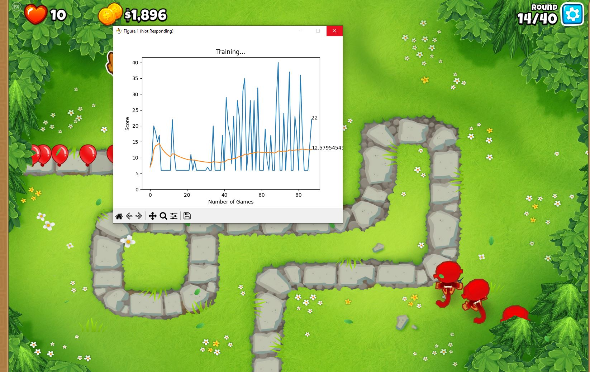

## BTD6 AI 
Purpose: Use AI to beat the video game Bloons Tower Defense 6.



### Info
Author: Christopher Wong

Last Update Date: 7/30/24

Design:
The program will use image processing AI to gather the necessary information on screen. Using that information, the program will then decide where and when to place monkeys and over time learn how to beat a map in BTD6. It will choose where to place monkeys by first randomly generating positions, then over time it will see what works and what doesn’t work.

Author Note:
Hello, this is my first 'real' CS project. I will try to update this and add more towers and other features. I am currently a rising Sophmore at Cal Poly SLO who is majoring in CS, any advice is appericated!

### Libraries and Versions
Python 3.12.0

- PyTorch 2.3.1
- matplotlib 3.9.1
- gym 0.26.2
- numpy 2.0.0
- opencv-python 4.10.0.84
- keyboard -.13.5
- PyAutoGUI 0.9.54
- pytesseract 0.3.10
- IPython 8.26.0

To install a package
```
pip install "package name"
```
To install a specific package
```
pip install "package name"==0.0.0
```

### References

https://www.youtube.com/watch?v=PY_N1XdFp4w&t=627s&ab_channel=NeuralNine 
https://www.geeksforgeeks.org/create-first-gui-application-using-python-tkinter/#
https://pytorch.org/tutorials/beginner/basics/buildmodel_tutorial.html 
https://pytorch.org/tutorials/intermediate/reinforcement_q_learning.html 
https://pythonprogramming.net/custom-environment-reinforcement-learning-stable-baselines-3-tutorial/
https://www.youtube.com/watch?v=uKnjGn8fF70&t=900s&ab_channel=sentdex 
https://www.youtube.com/watch?v=L8ypSXwyBds&t=3348s&ab_channel=freeCodeCamp.org 

### How to Run

0. Configuration
    1. This program is configured for a two monitor setup with one monitor being 1920x1080
    2. The program itself is configured for no monkey knowledge and easy maps
    3. Currently, it can only place bomb and ninja towers
1. Open up the game Bloons Tower Defense 6.
2. Select a map and select easy mode
    1. Do not select maps with white backgrounds as it breaks the image processing software
3. Run the agent.py file
    1. After a one game, it will activate the graph
4. To pause, wait for a round to start, then hit the 'esc' key, this will pause the game and the agent
5. To exit, press the 'Z' key, and navigate to the terminal and press CTRL + C

### Notes
#### Game Specific
This program also can only place bombs and ninjas as that is the minimum requirement of towers to beat an easy map. This program does not work with maps with white backgrounds. 

#### Program Specifc
This program does not have a save function, I will add one later. The loss function is mean error squared. 
The reward is caculated below. It is possible to make the reward also have money calculations, but I found that it was a hinderence. 
```
    def calculate_reward(self) -> float:
        nHealth = (self.prev_health - self.health) / 200  # the 200 is max health for easy
        self.prev_health = self.health
        nRounds = self.rounds / 40  # ditto
        reward = nHealth + nRounds
        '''
        log_money = np.log1p(abs(self.money))
        nMoney = log_money / 10000
        if self.rounds < 90:  # positive reward for more money in early rounds, negative reward for more money in later rounds
            reward += nMoney
        else:
            reward -= nMoney
        '''
        return reward
```